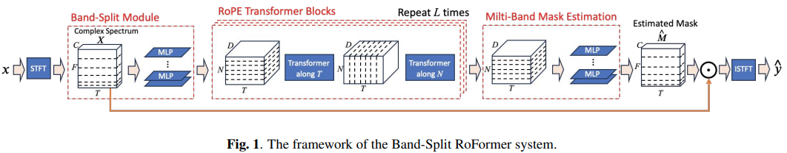

</img>

## BS-RoFormer

Implementation of <a href="https://arxiv.org/abs/2309.02612">Band Split Roformer</a>, SOTA Attention network for music source separation out of ByteDance AI Labs. They beat the previous first place by a large margin. The technique uses axial attention across frequency (hence multi-band) and time. They also have experiments to show that rotary positional encoding led to a huge improvement over learned absolute positions.

It also includes support for stereo training and outputting multiple stems.

Please join <a href="https://discord.gg/xBPBXfcFHd"></a> if you are interested in replicating a SOTA music source separator out in the open

## Appreciation

- <a href="https://stability.ai/">StabilityAI</a> and <a href="https://huggingface.co/">🤗 Huggingface</a> for the generous sponsorship, as well as my other sponsors, for affording me the independence to open source artificial intelligence.

- <a href="https://github.com/shenberg">Roee</a> and <a href="https://github.com/faroit">Fabian-Robert</a> for sharing their audio expertise and fixing audio hyperparameters

- <a href="https://github.com/chenht2010">@chenht2010</a> and <a href="https://github.com/ZFTurbo">Roman</a> for working out the default band splitting hyperparameter!

- <a href="https://github.com/dorpxam">Max Prod</a> for reporting a big bug with Mel-Band Roformer with stereo training!

- <a href="https://github.com/ZFTurbo">Roman</a> for successfully training the model and open sourcing his training code and weights at <a href="https://github.com/ZFTurbo/Music-Source-Separation-Training">this repository</a>!

- <a href="https://github.com/crlandsc">Christopher</a> for fixing an issue with multiple stems in Mel-Band Roformer

- <a href="https://github.com/iver56">Iver Jordal</a> for identifying that the default stft window function is not correct

## Install

```bash
$ pip install BS-RoFormer
```

## Usage

```python
import torch
from bs_roformer import BSRoformer

model = BSRoformer(
    dim = 512,
    depth = 12,
    time_transformer_depth = 1,
    freq_transformer_depth = 1
)

x = torch.randn(2, 352800)
target = torch.randn(2, 352800)

loss = model(x, target = target)
loss.backward()

# after much training

out = model(x)
```

To use the Mel-Band Roformer proposed in <a href="https://arxiv.org/abs/2310.01809">a recent follow up paper</a>, simply import `MelBandRoformer` instead

```python
import torch
from bs_roformer import MelBandRoformer

model = MelBandRoformer(
    dim = 32,
    depth = 1,
    time_transformer_depth = 1,
    freq_transformer_depth = 1
)

x = torch.randn(2, 352800)
target = torch.randn(2, 352800)

loss = model(x, target = target)
loss.backward()

# after much training

out = model(x)
```

## Todo

- [x] get the multiscale stft loss in there
- [x] figure out what `n_fft` should be
- [x] review band split + mask estimation modules

## Citations

```bibtex
@inproceedings{Lu2023MusicSS,
    title   = {Music Source Separation with Band-Split RoPE Transformer},
    author  = {Wei-Tsung Lu and Ju-Chiang Wang and Qiuqiang Kong and Yun-Ning Hung},
    year    = {2023},
    url     = {https://api.semanticscholar.org/CorpusID:261556702}
}
```

```bibtex
@inproceedings{Wang2023MelBandRF,
    title   = {Mel-Band RoFormer for Music Source Separation},
    author  = {Ju-Chiang Wang and Wei-Tsung Lu and Minz Won},
    year    = {2023},
    url     = {https://api.semanticscholar.org/CorpusID:263608675}
}
```

```bibtex
@misc{ho2019axial,
    title  = {Axial Attention in Multidimensional Transformers},
    author = {Jonathan Ho and Nal Kalchbrenner and Dirk Weissenborn and Tim Salimans},
    year   = {2019},
    archivePrefix = {arXiv}
}
```

```bibtex
@misc{su2021roformer,
    title   = {RoFormer: Enhanced Transformer with Rotary Position Embedding},
    author  = {Jianlin Su and Yu Lu and Shengfeng Pan and Bo Wen and Yunfeng Liu},
    year    = {2021},
    eprint  = {2104.09864},
    archivePrefix = {arXiv},
    primaryClass = {cs.CL}
}
```

```bibtex
@inproceedings{dao2022flashattention,
    title   = {Flash{A}ttention: Fast and Memory-Efficient Exact Attention with {IO}-Awareness},
    author  = {Dao, Tri and Fu, Daniel Y. and Ermon, Stefano and Rudra, Atri and R{\'e}, Christopher},
    booktitle = {Advances in Neural Information Processing Systems},
    year    = {2022}
}
```

```bibtex
@article{Bondarenko2023QuantizableTR,
    title   = {Quantizable Transformers: Removing Outliers by Helping Attention Heads Do Nothing},
    author  = {Yelysei Bondarenko and Markus Nagel and Tijmen Blankevoort},
    journal = {ArXiv},
    year    = {2023},
    volume  = {abs/2306.12929},
    url     = {https://api.semanticscholar.org/CorpusID:259224568}
}
```
